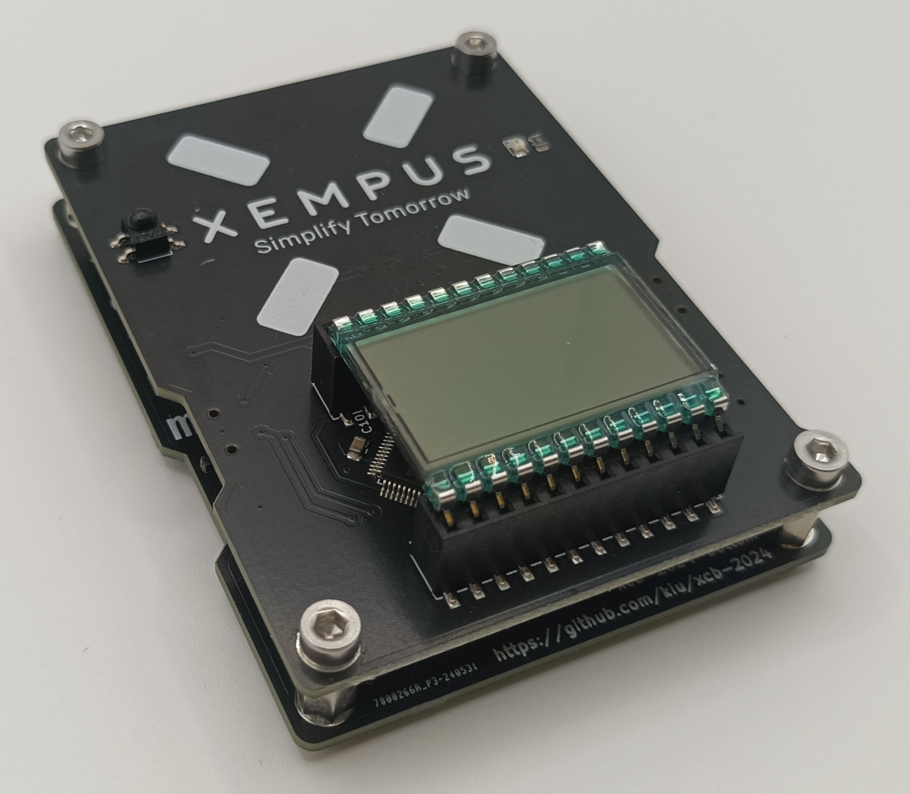

# xcb-2024
The cross communication badge (xcb) was created for a two day internal company conference. Its main purpose was to gamify communication and networking across the 150 participants.

Additional images can be found in the [img](img/) directory

# Features
The badge features three modes: Conference, Play and Sensor.

In <ins>conference mode</ins> each badge transmits its unique ID every 30 seconds. Any badge receiving two transmissions from the same badge within 100 seconds will count this as a unique contact. Due to limited infrared power, close proximity between sender and receiver is assumed. The amount of unique contacts is displayed on the LCD screen to gamify in-person encounters.

In addition secret badges are hidden at the event location, offering a treasure hunt for those who want to explore beyond the main conference tracks. The needed hints are printed on [flyers](xcb-2024-flyer.pdf) handed out with the badge. The discovery of these secret badges is encoded in the display as single segments to easily compare progress between participants.

It was important to me that the badge could be re-used after the conference so I added two additional modes.

In <ins>play mode</ins> the badge features a version of the popular game Simon https://en.wikipedia.org/wiki/Simon_(game) (in Germany known as Senso https://de.wikipedia.org/wiki/Senso_(Spiel)). People can chase a high score, which can also be displayed when in conference mode.

In <ins>sensor mode</ins> the badge transforms into a temperature and humidity display with min/max functionality. Powered by USB the badge can continue to operate in the home or office.

On the back of this stacked PCB assembly (preventing any electrical shorts while wearing) the participants can find a [silk screened word puzzle](img/xcb-2024-bottom-revb-render-back.png) containing the names of the employees of the company.

## Video
There is a short video highlighting all badge features on youtube: https://youtu.be/XA52-lHTVL4

# Hardware
The hardware is [straight forward](kicad/xcb-2024-top-revb-schematic.png). Powered by two CR2032 coin cells or USB, a STM32, a three digit LCD display, an infrared receiver/transmitter, a buzzer, four capacitive touch buttons and a temperature and humidity sensor. All neatly packed into a wearable badge.

# Repository
- [datasheets](datasheets/): Datasheets of most components
- [firmware](firmware/): STM32CubeIDE project
- [kicad](kicad/): KiCad schematics, PCBs and BOM for single+panelized badge and flash adapter
- [tools](tools/): Helper scripts to generate buzzer note table, mass flashing with auto ID increment and masked word puzzle generator

# License
This project is licensed under the Creative Commons Attribution-NonCommercial 3.0 Unported (CC BY-NC 3.0) license. Use of the company name and company logo in any form is not covered by this license.

# Thanks <3
Thanks to Fabian for helping out on the flyer design and Andrii, Maria (+Sebastian), Monika, Niels (+Milla) for working hard doing the final mechanical assembly!
